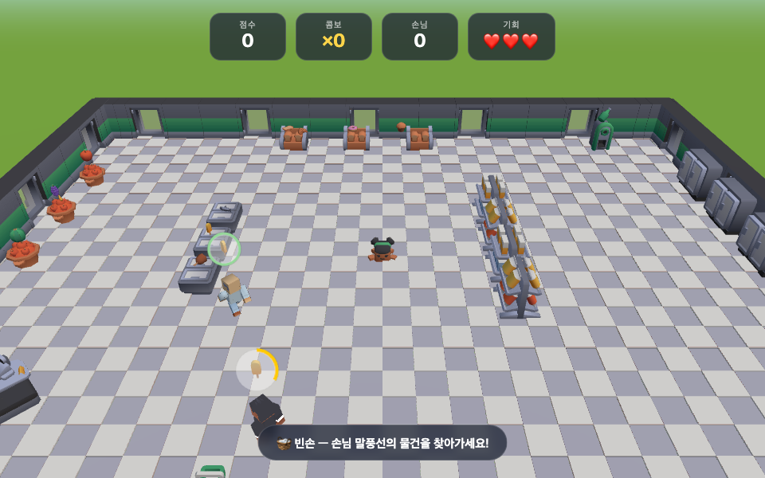

# 🛒 마켓 대시 (Market Dash)

A tiny 3D supermarket clerk game built with [Three.js](https://threejs.org/) and [Kenney](https://kenney.nl/) assets.

You're the new clerk at a mini market. Customers walk in with a speech bubble showing what they want — grab it from the right station and hand it over before their patience runs out. Miss three customers and the shop closes!



## How to play

```bash
# any static file server works
python3 -m http.server 8791
# then open http://localhost:8791
```

| Key | Action |
| --- | --- |
| Arrow keys (or `W` `A` `S` `D`) | Move |
| `Shift` | Sprint |
| `Q` | Put down the item you're carrying |

Arrow keys are the primary controls — WASD only works while the system input source is English (an active Korean IME can swallow letter keys).

Picking up and delivering happen **automatically** when you get close to a station or a customer.

## Gameplay

- 🧑‍🤝‍🧑 Customers enter and wait with a floating request bubble (a 3D model of the item) and a patience ring
- 🍎 5 stations: fruit display, bakery, chest freezers, shelves, and standing fridges — 20 different items
- 💯 Score = 100 + patience bonus + combo ×20; consecutive deliveries build your combo
- 😡 A customer whose patience hits zero storms out and costs you a heart (3 hearts total)
- 📈 Spawn rate ramps up and patience shrinks the longer you survive

## Tech

- Plain ES modules, no build step — Three.js r160 vendored in `lib/`
- Market assembled from Kenney's Mini Market kit; requests use Food Kit models
- Customers/player are Kenney Blocky Characters with their built-in animation clips
  (`idle` / `walk` / `sprint` / `pick-up` / `emote-yes` / `emote-no`) driven by `THREE.AnimationMixer`
- Per-axis AABB collision, canvas-texture patience rings, follow camera

## Credits

- 3D models: [Kenney](https://kenney.nl/) — Mini Market, Food Kit, Blocky Characters (CC0)
- Sounds: [Kenney Interface Sounds](https://kenney.nl/assets/interface-sounds) (CC0)
- Engine: [Three.js](https://threejs.org/) (MIT)
